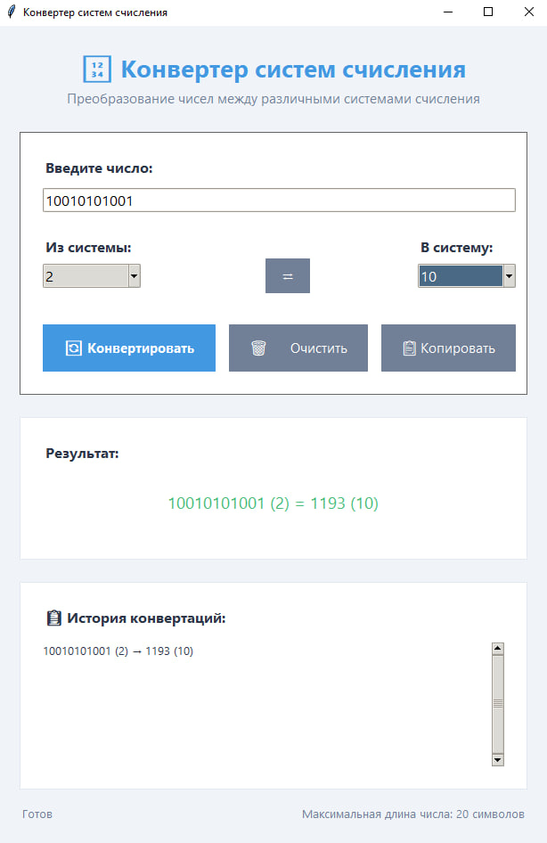
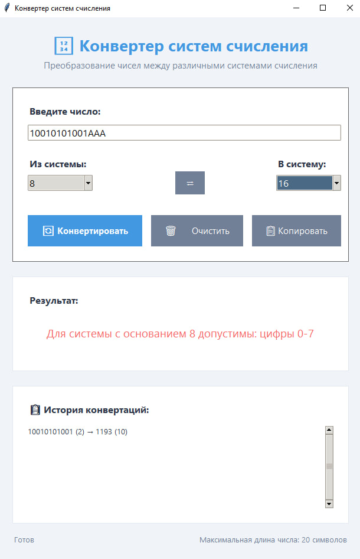

# Конвертер систем счисления

Простое и эффективное приложение для перевода чисел между различными системами счисления с интуитивно понятным графическим интерфейсом.

## 📌 Основной функционал

### 🔢 Поддерживаемые системы счисления
- **Двоичная** (2) - цифры 0-1
- **Восьмеричная** (8) - цифры 0-7
- **Десятичная** (10) - цифры 0-9
- **Шестнадцатеричная** (16) - цифры 0-9, буквы A-F

### 🔄 Функции конвертации
- Перевод чисел между любыми поддерживаемыми системами
- Автоматическая проверка корректности ввода
- Валидация чисел для каждой системы счисления
- Поддержка длинных чисел (до 20 символов)

### 📋 Дополнительные возможности
- **История операций** - сохранение последних 10 конвертаций
- **Копирование результата** - одним кликом в буфер обмена
- **Очистка полей** - быстрый сброс всех данных
- **Горячие клавиши** - Enter для быстрой конвертации

### ⚡ Особенности интерфейса
- Современный дизайн с карточным оформлением
- Цветовая индикация результатов (успех/ошибка)
- Подсказки при наведении на элементы
- Статус бар с информацией о состоянии

## 🖼️ Визуализация интерфейса

### Основное окно конвертера

*Интерфейс включает поля ввода, выбор систем счисления и кнопки управления*

### Результат конвертации

*Отображение результата с историей предыдущих операций*

### Обработка ошибок

*Информативные сообщения об ошибках при некорректном вводе*

## 🛠 Технологический стек
- **Язык программирования**: Python 3.8+
- **Графический интерфейс**: Tkinter
- **Стилизация**: ttk для современных виджетов
- **Валидация**: Регулярные выражения

## 🚀 Запуск приложения
- python main.py

## Требования
- Python 3.8 или выше
- Установленный Tkinter (обычно входит в стандартную поставку Python)
- Доступ к файловой системе для сохранения истории операций